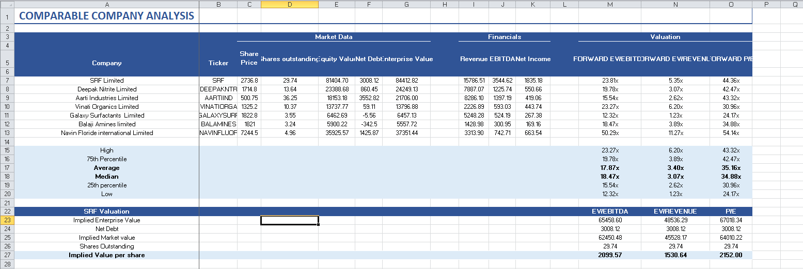

# 📊 Comparable Company Analysis (CCA) – Specialty Chemicals Sector

## 🎯 Objective
Perform a Comparable Company Analysis (CCA) of leading Indian specialty chemical companies to evaluate their relative valuation and financial performance using market and financial metrics.

## 🛠 Tools Used
- Microsoft Excel
- Financial Modeling
- Valuation Analysis
- Forecasting Techniques

## 📈 Key Insights
- Compared valuation multiples across peer companies.
- Calculated Enterprise Value (EV) and Equity Value.
- Analyzed EV/EBITDA, EV/Revenue, and P/E multiples.
- Forecasted FY26 and FY27 financial performance using historical growth trends.
- Identified industry median and average valuation benchmarks.

## 🚀 Business Impact
Provides investors, analysts, and finance professionals with a framework to:
- Benchmark companies against industry peers.
- Assess relative valuation opportunities.
- Support investment and M&A decision-making.
- Understand market pricing of specialty chemical businesses.

## 📂 Project Components
- Peer Company Analysis
- Enterprise Value Calculation
- Forward Financial Projections
- Valuation Multiples Analysis
- Industry Benchmarking

## 📷 Project Preview

## 📚 Skills Demonstrated
- Financial Modeling
- Equity Research
- Company Valuation
- Financial Statement Analysis
- Forecasting & Projections
- Corporate Finance

## 👨‍💼 Author
Pratha Jain
